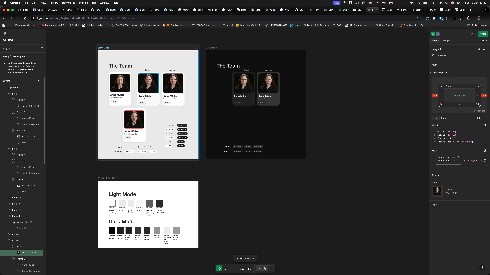

# Web Developer task 2026

You will receive two attachments along with this task:
- Template snippet (for Part 1)
- team_data.json data (for Parts 2 and 3)

Please use these files as the basis for your work.

## TASK

1. Code review / refactoring suggestions [PHP](./php.md)
Based on the provided PHP template snippet, describe how you would improve this
code.
You don’t have to write fully working code; a short write-up in .md, .pdf or .txt
explaining your approach and/or showing small, refactored examples is enough.

2. Component design (UI/UX)
Using any tool you prefer, create a mock-up of: a) a team member card and b) a list
of cards within a page based on the provided team data.
A screenshot or export of your mock-up, or a link to an online tool is sufficient.



3. Implementation (modern frontend)
Using any modern frontend tooling you prefer, implement your mock-up and display
a list of team member cards using the provided team data.
Please include brief instructions in a README on how to run your solution. Your
submission may be provided as a Git repository link, or a zipped project folder.

## Notes
Please don’t spend more than a few hours on this exercise; we’re more interested in
your approach and reasoning than in perfect polish.

## Installation Instructions

1. Ensure you have Node.js installed (version 16 or higher recommended).
2. Clone the repository or unzip the project folder to your local machine.
3. Open a terminal and navigate to the project directory.
4. Install the project dependencies by running:
   ```bash
   npm install
   ```
   or, if you prefer using Yarn:
   ```bash
   yarn install
   ```
5. Start the development server with:
   ```bash
   npm run dev
   ```
   or, if using Yarn:
   ```bash
   yarn dev
   ```
6. Open your web browser and go to `http://localhost:5173` to view

## Design and Implementation Notes

- The tech stack used is Vite with React.
- The CSS is modular and uses CSS variables to keep the design consistent and easily adjustable.
- The initial layout was created in Figma.
- All images used were sourced from Pexels and iconifiy.design as they are all free to use.
- The fonts are from Google Fonts but loaded locally as to sidestep GDPR issues (not an issue with local installation).
- The team member data is loaded from the provided `Agora_web_developer_team_data.json` file and displayed in a responsive card layout. There is no modification of the data and all link type detection is done in the frontend.
- All SVGs are CSS inlined for performance and ease of use.
- It is not responsive beyond desktop widths.
- I did spend a bit more than a few hours on this exercise as I wanted to ensure I delivered a quality solution and I was having fun.